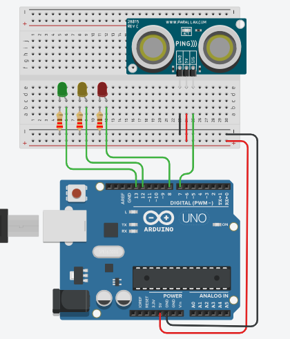

# Arduino Ultrasonic Distance LED Indicator

## Overview
This project demonstrates how to use an **Ultrasonic Sensor (HC-SR04)** with an **Arduino Uno** to measure distance and provide visual feedback using **LEDs**.



The LEDs act as indicators:
- Green → Object is far
- Yellow → Object is at medium distance
- Red → Object is very close

This project is useful for understanding:
- Distance measurement using ultrasonic waves
- Sensor input processing
- Conditional logic
- Real-time feedback using LEDs

---

## Components
- Arduino Uno
- Ultrasonic Sensor (HC-SR04)
- 3 LEDs (Green, Yellow, Red)
- 3 Resistors (220Ω recommended)
- Breadboard
- Jumper Wires
- USB Cable

---

## Wiring

### Ultrasonic Sensor (HC-SR04)
- **VCC** → Arduino **5V**
- **GND** → Arduino **GND**
- **TRIG** → Digital Pin **9**
- **ECHO** → Digital Pin **10**

### LEDs
Each LED should be connected with a resistor:

- **Green LED**
  - Anode (+) → Digital Pin **2**
  - Cathode (-) → Resistor → GND

- **Yellow LED**
  - Anode (+) → Digital Pin **3**
  - Cathode (-) → Resistor → GND

- **Red LED**
  - Anode (+) → Digital Pin **4**
  - Cathode (-) → Resistor → GND

---

## How It Works
1. The ultrasonic sensor sends a sound wave using the **TRIG** pin.
2. The wave reflects back when it hits an object.
3. The **ECHO** pin measures the time taken for the wave to return.
4. The Arduino calculates the distance.
5. Based on the distance:
   - Far → Green LED ON
   - Medium → Yellow LED ON
   - Near → Red LED ON

---

## Code
```cpp
const int pingPin = 7;

const int redLED = 8;
const int yellowLED = 12;
const int greenLED = 13;

void setup() {
  Serial.begin(9600);

  pinMode(redLED, OUTPUT);
  pinMode(yellowLED, OUTPUT);
  pinMode(greenLED, OUTPUT);
}

void loop() {
  long duration;
  float distance;

 
  pinMode(pingPin, OUTPUT);
  digitalWrite(pingPin, LOW);
  delayMicroseconds(2);
  digitalWrite(pingPin, HIGH);
  delayMicroseconds(5);
  digitalWrite(pingPin, LOW);

  pinMode(pingPin, INPUT);
  duration = pulseIn(pingPin, HIGH);

  distance = duration * 0.034 / 2;

  Serial.print("Distance: ");
  Serial.print(distance);
  Serial.println(" cm");

  if (distance < 30) {
    digitalWrite(redLED, HIGH);
    digitalWrite(yellowLED, LOW);
    digitalWrite(greenLED, LOW);
  }
  else if (distance >= 30 && distance < 110) {
    digitalWrite(redLED, LOW);
    digitalWrite(yellowLED, HIGH);
    digitalWrite(greenLED, LOW);
  }
  else {
    digitalWrite(redLED, LOW);
    digitalWrite(yellowLED, LOW);
    digitalWrite(greenLED, HIGH);
  }

  delay(200);
}
